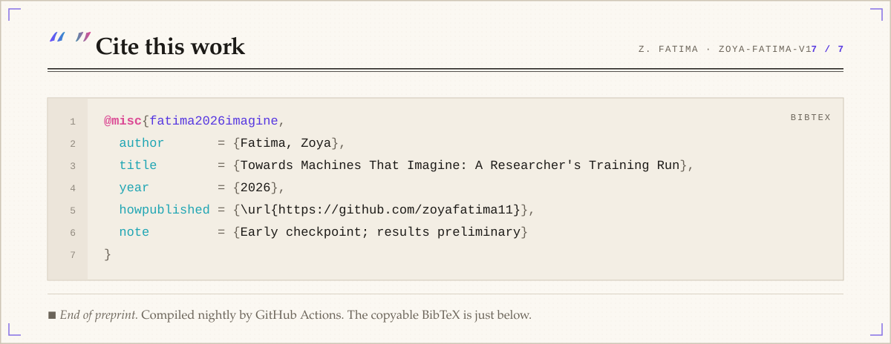

<!-- Generated by scripts/build.mjs from profile.config.mjs. Edit that, not this file. -->

<a id="top"></a><picture><source media="(prefers-color-scheme: dark)" srcset="assets/p-title-dark.svg"></picture>

<p align="center"><a href="#abstract"><picture><source media="(prefers-color-scheme: dark)" srcset="assets/tab-abstract-dark.svg"></picture></a> <a href="#interests"><picture><source media="(prefers-color-scheme: dark)" srcset="assets/tab-interests-dark.svg"></picture></a> <a href="#roadmap"><picture><source media="(prefers-color-scheme: dark)" srcset="assets/tab-roadmap-dark.svg"></picture></a> <a href="#model-card"><picture><source media="(prefers-color-scheme: dark)" srcset="assets/tab-model-card-dark.svg"></picture></a> <a href="#references"><picture><source media="(prefers-color-scheme: dark)" srcset="assets/tab-references-dark.svg"></picture></a> <a href="#cite"><picture><source media="(prefers-color-scheme: dark)" srcset="assets/tab-cite-dark.svg"></picture></a></p>

<a id="abstract"></a><picture><source media="(prefers-color-scheme: dark)" srcset="assets/p-abstract-dark.svg"></picture>

<a id="interests"></a><picture><source media="(prefers-color-scheme: dark)" srcset="assets/p-interests-dark.svg"></picture>

<a id="roadmap"></a><picture><source media="(prefers-color-scheme: dark)" srcset="assets/p-roadmap-dark.svg"></picture>

<a id="model-card"></a><picture><source media="(prefers-color-scheme: dark)" srcset="assets/p-modelcard-dark.svg"></picture>

<a id="references"></a><picture><source media="(prefers-color-scheme: dark)" srcset="assets/p-references-dark.svg"></picture>

<p>
<a href="https://arxiv.org/abs/1312.6114"><picture><source media="(prefers-color-scheme: dark)" srcset="assets/ref-01-dark.svg"></picture></a>
<a href="https://arxiv.org/abs/1406.2661"><picture><source media="(prefers-color-scheme: dark)" srcset="assets/ref-02-dark.svg"></picture></a>
<a href="https://arxiv.org/abs/1706.03762"><picture><source media="(prefers-color-scheme: dark)" srcset="assets/ref-03-dark.svg"></picture></a>
<a href="https://arxiv.org/abs/2005.14165"><picture><source media="(prefers-color-scheme: dark)" srcset="assets/ref-04-dark.svg"></picture></a>
<a href="https://arxiv.org/abs/2006.11239"><picture><source media="(prefers-color-scheme: dark)" srcset="assets/ref-05-dark.svg"></picture></a>
<a href="https://arxiv.org/abs/2005.11401"><picture><source media="(prefers-color-scheme: dark)" srcset="assets/ref-06-dark.svg"></picture></a>
<a href="https://arxiv.org/abs/2106.09685"><picture><source media="(prefers-color-scheme: dark)" srcset="assets/ref-07-dark.svg"></picture></a>
<a href="https://arxiv.org/abs/2112.10752"><picture><source media="(prefers-color-scheme: dark)" srcset="assets/ref-08-dark.svg"></picture></a>
<a href="https://arxiv.org/abs/2201.11903"><picture><source media="(prefers-color-scheme: dark)" srcset="assets/ref-09-dark.svg"></picture></a>
<a href="https://arxiv.org/abs/2203.02155"><picture><source media="(prefers-color-scheme: dark)" srcset="assets/ref-10-dark.svg"></picture></a>
</p>

<a id="cite"></a><picture><source media="(prefers-color-scheme: dark)" srcset="assets/p-cite-dark.svg"></picture>

<details><summary><sub>Copy BibTeX</sub></summary>

```bibtex
@misc{fatima2026imagine,
  author       = {Fatima, Zoya},
  title        = {Towards Machines That Imagine: A Researcher's Training Run},
  year         = {2026},
  howpublished = {\url{https://github.com/zoyafatima11}},
  note         = {Early checkpoint; results preliminary}
}
```
</details>

<p align="right"><a href="#top"><sub>↑ back to the title page</sub></a></p>
