<!-- Generated from README.template.md + profile.config.mjs by scripts/build.mjs. Edit those, not this file. -->
<picture>
  <source media="(prefers-color-scheme: dark)" srcset="assets/fig-title-dark.svg">
  
</picture>

<p align="center"><sub><a href="#abstract">Abstract</a> · <a href="#1-research-interests">Research interests</a> · <a href="#2-roadmap">Roadmap</a> · <a href="#3-model-card">Model card</a> · <a href="#references">References</a> · <a href="#cite-this-profile">Cite this profile</a></sub></p>

## Abstract

> **We present _Zoya Fatima_**, a researcher currently in early pre-training. Unlike models that learn from one pass over the internet, she learns the slow way: reading closely, reproducing results by hand, and asking *why* a model behaves the way it does before asking how to make it bigger.
>
> This page logs the run so far: a grounding in research methods and the fundamentals of AI. It also maps the generative-AI checkpoints she is training toward over the next few years: transformers, diffusion models, retrieval, agents and alignment. Results are preliminary. Collaborators are welcome.

<p><sub>✉︎ <b>Correspondence:</b> <a href="https://github.com/zoyafatima11">@zoyafatima11</a> on GitHub</sub></p>

## 1. Research interests

<picture>
  <source media="(prefers-color-scheme: dark)" srcset="assets/fig-attention-dark.svg">
  
</picture>

Her questions sit where **how models learn** meets **what they make**: why attention works, how diffusion turns noise into structure, and how to tell when a generative model is right versus merely fluent.

## 2. Roadmap

<picture>
  <source media="(prefers-color-scheme: dark)" srcset="assets/fig-curve-dark.svg">
  
</picture>

## 3. Model card

<picture>
  <source media="(prefers-color-scheme: dark)" srcset="assets/fig-modelcard-dark.svg">
  
</picture>

## References

<sub>The reading queue, in the order the ideas build on each other. 📖 reading · ✅ read · ◻️ queued</sub>

◻️ **[1]** Kingma &amp; Welling (2013). *Auto-Encoding Variational Bayes.* ICLR 2014. [arXiv:1312.6114](https://arxiv.org/abs/1312.6114)<br>
◻️ **[2]** Goodfellow et al. (2014). *Generative Adversarial Nets.* NeurIPS 2014. [arXiv:1406.2661](https://arxiv.org/abs/1406.2661)<br>
📖 **[3]** Vaswani et al. (2017). *Attention Is All You Need.* NeurIPS 2017. [arXiv:1706.03762](https://arxiv.org/abs/1706.03762)<br>
◻️ **[4]** Brown et al. (2020). *Language Models are Few-Shot Learners.* NeurIPS 2020. [arXiv:2005.14165](https://arxiv.org/abs/2005.14165)<br>
◻️ **[5]** Ho, Jain &amp; Abbeel (2020). *Denoising Diffusion Probabilistic Models.* NeurIPS 2020. [arXiv:2006.11239](https://arxiv.org/abs/2006.11239)<br>
◻️ **[6]** Lewis et al. (2020). *Retrieval-Augmented Generation for Knowledge-Intensive NLP Tasks.* NeurIPS 2020. [arXiv:2005.11401](https://arxiv.org/abs/2005.11401)<br>
◻️ **[7]** Hu et al. (2021). *LoRA: Low-Rank Adaptation of Large Language Models.* ICLR 2022. [arXiv:2106.09685](https://arxiv.org/abs/2106.09685)<br>
◻️ **[8]** Rombach et al. (2021). *High-Resolution Image Synthesis with Latent Diffusion Models.* CVPR 2022. [arXiv:2112.10752](https://arxiv.org/abs/2112.10752)<br>
◻️ **[9]** Wei et al. (2022). *Chain-of-Thought Prompting Elicits Reasoning in Large Language Models.* NeurIPS 2022. [arXiv:2201.11903](https://arxiv.org/abs/2201.11903)<br>
◻️ **[10]** Ouyang et al. (2022). *Training Language Models to Follow Instructions with Human Feedback.* NeurIPS 2022. [arXiv:2203.02155](https://arxiv.org/abs/2203.02155)

## Cite this profile

```bibtex
@misc{fatima2026imagine,
  author       = {Fatima, Zoya},
  title        = {Towards Machines That Imagine: A Researcher's Training Run},
  year         = {2026},
  howpublished = {\url{https://github.com/zoyafatima11}},
  note         = {Early checkpoint; results preliminary}
}
```

<p align="right"><sub><i>Last compiled by GitHub Actions. Comments and pull requests are welcome.</i> ∎</sub></p>
